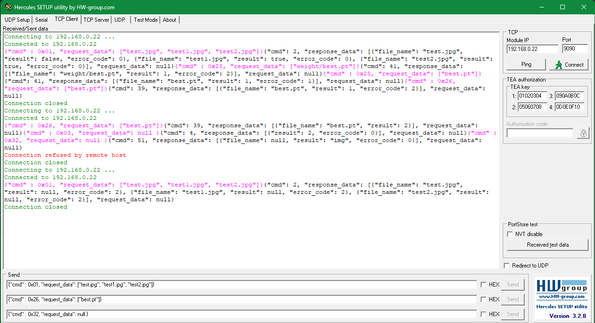
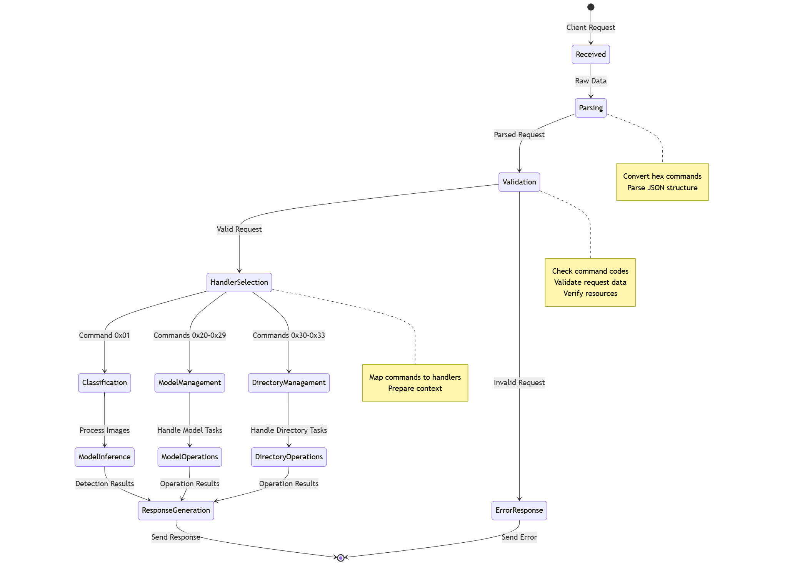

## Installation
- Navigate to the directory containing your requirements.txt file. Run the following command:
```
pip install -r requirements.txt
```
- Pretrained model: `weights/`: [best.pt](https://github.com/user-attachments/files/17640870/best8n.zip)


## How to run

- Run `python app.py` to start the Server service
- Example of a request from the client:
```shell
{"cmd" : 0x01, "request_data": ["test.jpg", "test1.jpg", "test2.jpg"]}
```

***

### Application using for testing (TCP Client)


## Other request:
#### Model Download Request
```
{"cmd" : 0x20, "request_data": ["https://github.com/AISeedHub/pretrained-models/releases/download/PearDetection/best.pt"]}
```
Expected Response:
```
"{"cmd": 33, "response_data": [{"file_name": null, "result": 2, "error_code": 0}], "request_data": null}"
```

#### Current Model Request
```
{"cmd" : 0x22, "request_data": null}
```
Expected Response:
```
"{"cmd": 35, "response_data": [{"file_name": null, "result": "best.pt", "error_code": 0}], "request_data": null}"
```


#### List All Model Request
```
{"cmd" : 0x24, "request_data": null}
```
Expected Response:
```
"{"cmd": 37, "response_data": [{"file_name": "best.pt", "result": 2, "error_code": 0}, {"file_name": "best (1).pt", "result": 2, "error_code": 0}, {"file_name": "bk.pt", "result": 2, "error_code": 0}], "request_data": null}"
```

#### Change Model Request
```
{"cmd" : 0x26, "request_data": ["bk.pt"]}
```
Expected Response:
```
"{"cmd": 39, "response_data": [{"file_name": "bk.pt", "result": 2, "error_code": 0}], "request_data": null}"
```

#### Current Img Folder Request
```
{"cmd" : 0x32, "request_data": null}
```
Expected Response:
```
"{"cmd": 51, "response_data": [{"file_name": null, "result": "img", "error_code": 0}], "request_data": null}"
```

#### Change Img Folder Request
```
{"cmd" : 0x30, "request_data": ["img2"]}
```
Expected Response:
```
"{"cmd": 49, "response_data": [{"file_name": "img2", "result": 2, "error_code": 0}], "request_data": null}"
```

#### Delete Model Request
```
{"cmd" : 0x28, "request_data": ["best (1).pt"]}
```
Expected Response:
```
"{"cmd": 41, "response_data": [{"file_name": "best (1).pt", "result": 2, "error_code": 0}], "request_data": null}"
```

# Development Guide
## 1. Directory Structure
```
pear_detection/
├── src/
│   ├── server/
│   │   ├── tcp_server.py      # TCP server implementation
│   │   ├── peer.py            # Connection handler
│   │   └── connection_manager.py
│   ├── handlers/
│   │   ├── base_handler.py    # Abstract handler class
│   │   ├── classification_handler.py
│   │   ├── model_handler.py
│   │   └── directory_handler.py
│   ├── model/
│   │   └── detector.py   # ML model wrapper
│   └── utils/
│       ├── parsers.py         # Command parsing
│       ├── validators.py      # Request validation
│       └── exceptions.py      # Custom exceptions
├── config/
│   └── server_config.yaml     # Server configuration
└── tests/
    ├── test_server.py
    ├── test_handlers.py
    └── test_model.py
```

## 2. Command Processing Flow

