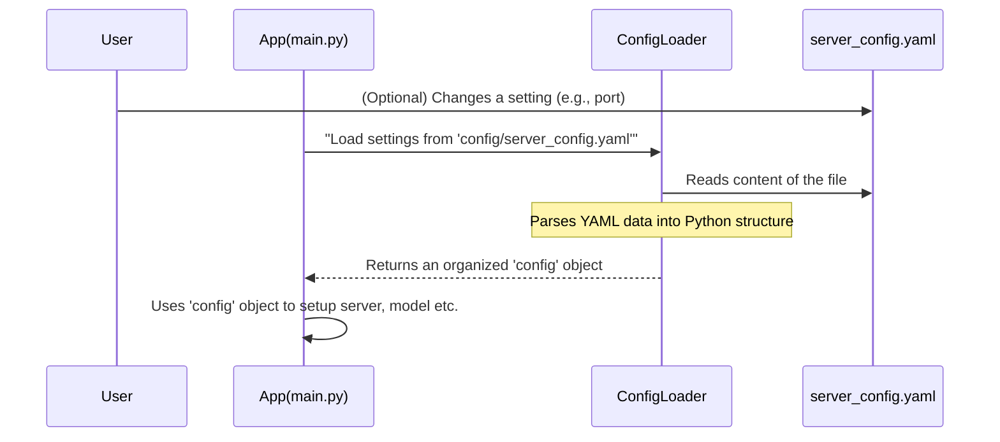

# Chapter 1: Application Configuration

Welcome to the **LinuxIT-TCP-IP** project! In this first chapter, we're going to explore a fundamental concept that makes our application smart and flexible: **Application Configuration**.

Imagine you have a new toy. Before you play with it, you might read a small instruction manual that tells you how to set it up – like which batteries to use or if it needs to connect to Wi-Fi. In the world of software, our applications also need instructions on how to behave.

## The Problem: What if settings change?

Let's say our application needs to connect to a specific "address" (like a street address on the internet, called a "host") and a "port number" (like an apartment number at that address) to communicate with other programs. What if we want to change this address or port later? Or what if our application uses an advanced AI "model" (like a trained brain for detecting pears!), and we want to update this model to a newer version without changing the core program?

If these settings were hard-coded (meaning, directly written) into the application's main code, every time we wanted to make a small change, we'd have to:
1.  Find the specific line of code.
2.  Change it.
3.  Re-build the entire application.
4.  Distribute the new version.

This can be a lot of work and prone to errors for simple updates!

## The Solution: Application Configuration

This is where **Application Configuration** comes in! It's like giving our application a separate instruction manual or a central control panel. Instead of hard-coding values, we store all these important settings in a special file. This file acts as the app's "brain" for initial setup.

For our project, this "instruction manual" is named `server_config.yaml`. The `.yaml` part just means it's a specific kind of file format, which is very easy for both humans and computers to read.

### Our Use Case: Changing the Server Port

Let's take a common example: our application runs a "server" that listens for connections from other programs. By default, it might listen on "port 9090". What if we need it to listen on "port 8080" instead? Application Configuration allows us to do this effortlessly.

Here's how our `server_config.yaml` file might look for this specific setting:

```yaml
# config/server_config.yaml (partial view)
server:
  host: "0.0.0.0"
  port: 9090 # This is the current port
  # ... other settings
```

To change the port to `8080`, all you need to do is open this file with a text editor and change `9090` to `8080`:

```yaml
# config/server_config.yaml (after changing the port)
server:
  host: "0.0.0.0"
  port: 8080 # Changed to 8080!
  # ... other settings
```

Once you save this file and restart the application, it will automatically use the new port `8080`! You didn't need to touch any Python code or recompile anything. How cool is that?

## How Our App Uses Configuration

Now, let's see how our application uses this `server_config.yaml` file at the very beginning when it starts up.

Look at this small part of our main application file (`app.py`):

```python
# app.py
import asyncio
# ... other imports
from src.utils.config import ConfigLoader # This helper will load our config!

async def main():
    try:
        # Load configuration from the file
        config = ConfigLoader.load('config/server_config.yaml')

        # Now, 'config' holds all our settings!
        # For example, to get the server port:
        # print(config.server.port) # This would print 9090 or 8080

        # The rest of the app then uses these settings:
        # detector = PearDetector(config.model)
        # server = TCPServer(config.server, detector)
        # await server.start()

    except Exception as e:
        # ... error handling
```

In this code:
*   `ConfigLoader.load('config/server_config.yaml')` is the key part. It tells our application: "Go to the `config` folder, find `server_config.yaml`, and read all the settings from it."
*   The settings are then stored in a variable called `config`.
*   Later parts of our application (like setting up the `PearDetector` or the `TCPServer`) simply ask `config` for the information they need. For example, `config.server` gives access to all server-related settings, and `config.model` gives model settings.

## Under the Hood: How Configuration is Loaded

Let's peek behind the scenes to understand how our `ConfigLoader` works its magic.

Imagine this sequence of events when the application starts:



1.  **User Interaction (Optional):** A person (like you!) might open `server_config.yaml` and change a value, such as the `port` number.
2.  **App Starts:** When the application (`main.py`) begins, its first important job is to get its instructions.
3.  **Loading Request:** `main.py` asks the `ConfigLoader` (which is a special helper in `src/utils/config.py`) to "load" the settings from `config/server_config.yaml`.
4.  **File Reading:** The `ConfigLoader` then opens and reads the raw text from the `server_config.yaml` file.
5.  **Parsing:** `ConfigLoader` uses a tool (a `yaml` library) to understand the structure of the YAML file and turn it into a neat Python "dictionary" (like a list of `key: value` pairs).
6.  **Organizing Data:** More importantly, `ConfigLoader` takes this raw dictionary and puts it into specially designed "containers" (called `dataclasses` in Python). This makes it very easy and safe for the rest of the app to get the settings later on (e.g., `config.server.port` instead of `config['server']['port']`).
7.  **Returning Config:** Finally, `ConfigLoader` gives this perfectly organized `config` object back to `main.py`.
8.  **Application Setup:** `main.py` then uses the settings from this `config` object to set up all the different parts of the application, like the server and the pear detection model.

### The `server_config.yaml` File

Let's look at a more complete `server_config.yaml` file:

```yaml
# config/server_config.yaml
server:
  host: "0.0.0.0"
  port: 9090
  max_connections: 5
  buffer_size: 1024
  encoding: "utf-8"

model:
  model_path: "weights/best.pt"
  img_path: "img"
  confidence_threshold: 0.9
  img_size: 640
  classes:
    - 'burn_bbox'
    - 'defected_pear'
    - 'defected_pear_bbox'
    - 'normal_pear'
    - 'normal_pear_bbox'

logging:
  level: "INFO"
  format: "%(asctime)s - %(name)s - %(levelname)s - %(message)s"
  file: "logs/pear_detection.log"
```

Notice how the settings are grouped under clear headings like `server`, `model`, and `logging`. This makes the file very readable and organized!

### The `ConfigLoader` Code (`src/utils/config.py`)

Here's a simplified look at the `ConfigLoader` that reads our YAML file:

```python
# src/utils/config.py (simplified)
import yaml # This tool helps read YAML files
import logging
from dataclasses import dataclass
from typing import Dict, Any

# These are like blueprints for specific sections of our config
from ..server.tcp_server import ServerConfig # For server settings
from ..model.pear_detector import ModelConfig # For model settings

# A blueprint for logging settings
@dataclass
class LoggingConfig:
    level: str
    format: str
    file: str

# The main blueprint for ALL our application settings
@dataclass
class ApplicationConfig:
    server: ServerConfig
    model: ModelConfig
    logging: LoggingConfig

    # A special function to create an ApplicationConfig from raw data
    @classmethod
    def from_dict(cls, config_dict: Dict[str, Any]) -> 'ApplicationConfig':
        return cls(
            server=ServerConfig(**config_dict['server']),
            model=ModelConfig(**config_dict['model']),
            logging=LoggingConfig(**config_dict['logging'])
        )

# The actual loader that does the work
class ConfigLoader:
    @staticmethod
    def load(config_path: str) -> ApplicationConfig:
        try:
            with open(config_path, 'r') as f:
                config_dict = yaml.safe_load(f) # Reads the YAML file into a Python dictionary
            # Converts the dictionary into our neatly structured ApplicationConfig object
            return ApplicationConfig.from_dict(config_dict)
        except Exception as e:
            # If something goes wrong, it tells us!
            logging.error(f"Failed to load configuration: {e}")
            raise
```

Let's break down the key parts of this code:

*   **`import yaml`**: This line brings in a special tool (a Python library) that knows how to read and understand `.yaml` files.
*   **`@dataclass`**: These are super handy Python features that let us create "data containers" easily.
    *   `LoggingConfig`: This container is specifically for holding all the `logging` settings.
    *   `ApplicationConfig`: This is the *main* container. It holds smaller containers for `server`, `model`, and `logging` settings. This is why you can access settings like `config.server.port` – `config` is an `ApplicationConfig` object, and it has a `server` part which itself is a `ServerConfig` object!
*   **`from_dict` function**: After `yaml.safe_load(f)` reads the file into a generic Python dictionary, this function takes that messy dictionary and carefully places each setting into the correct, organized `dataclass` container (`ServerConfig`, `ModelConfig`, `LoggingConfig`). This ensures that our `config` object is easy to use and understand.
*   **`ConfigLoader.load(config_path)`**: This is the actual function that `main.py` calls. It opens the specified file, uses `yaml` to read it, and then organizes all the settings into the `ApplicationConfig` object that is returned.

You might notice `ServerConfig` and `ModelConfig` are imported from other places. This is a good design! It means that the details about what makes up a `ServerConfig` are defined where the [TCP Server](06_tcp_server_.html) is set up, and `ModelConfig` is defined near the [Pear Detection Model (PearDetector)](03_pear_detection_model__peardetector__.html). This keeps our code organized and prevents duplication.

## Conclusion

In this chapter, we've learned that **Application Configuration** is like giving our software an instruction manual (`server_config.yaml`) that it reads at startup. This makes our application very flexible, allowing us to change important settings (like the server port or the AI model's path) without ever touching or recompiling the core code. This separation of settings from code is a powerful idea in software development!

Now that our application knows how to read its own instructions, what about how it talks to the outside world? In the next chapter, we'll dive into the fascinating concept of the **[Communication Protocol](02_communication_protocol_.html)**, which defines the language our application speaks.

