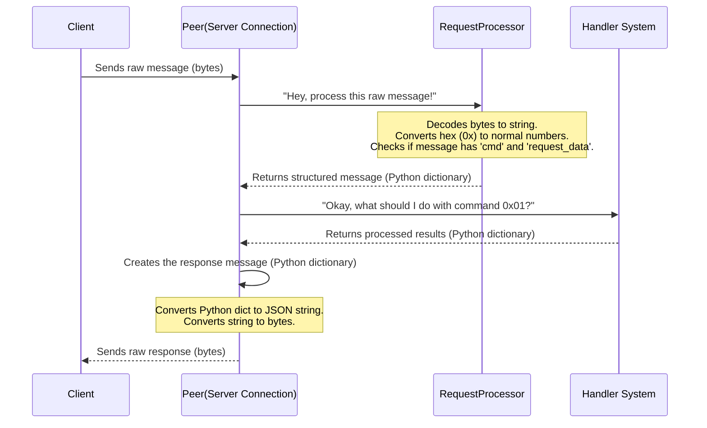

# Chapter 2: Communication Protocol

Welcome back! In [Chapter 1: Application Configuration](01_application_configuration_.html), we learned how our application reads its instructions from a special `server_config.yaml` file. This makes our app flexible, allowing us to change settings like the server's port without touching the code.

But what happens after our application starts and is ready to do its job? It needs to talk to other programs, like a "client" program that wants to use our server to detect pears in images. Just like people need a common language to understand each other, computer programs also need a clear, agreed-upon way to communicate.

## The Problem: Speaking the Same Language

Imagine you're trying to order food in a foreign country where you don't know the language, and they don't know yours. It would be chaotic! You might point at pictures, make gestures, but true understanding would be difficult.

The same problem exists in the world of computer programs. If our **LinuxIT-TCP-IP** server program wants to receive a request from a client (like "Please detect pears in these pictures!"), and the client program wants to understand the server's response ("Okay, here are the pears I found!"), they both need to speak the exact same "language" and follow the same "rules" for sending messages.

Without these rules, the server might send a message, and the client would just see a jumble of characters, unable to figure out what it means. It would be like getting a message written in hieroglyphs when you only understand English!

## The Solution: Communication Protocol

This is where the **Communication Protocol** comes in! It's like a detailed "rulebook" or a "shared language" that both the client and our server agree to follow when exchanging information over the network. This rulebook specifies:

*   **What format messages should be in:** (e.g., "Always use JSON!")
*   **What information messages *must* contain:** (e.g., "Every message needs a 'command' field.")
*   **How certain values are represented:** (e.g., "Command codes are numbers, sometimes written in hexadecimal!")

By following this strict rulebook, both our server and any client can reliably understand, process, and respond to each other's messages, enabling seamless interaction.

## The "Language" of LinuxIT-TCP-IP: Our Protocol Details

For the **LinuxIT-TCP-IP** project, our communication protocol is designed to be clear and easy for programs to parse. It has a few key rules:

1.  **Messages are JSON Dictionaries:**
    All messages sent between the client and server must be in **JSON (JavaScript Object Notation)** format. JSON is great because it's human-readable, and many programming languages have built-in tools to work with it. It looks a lot like Python dictionaries.

2.  **Every Message Needs `cmd`:**
    Each message must be a JSON dictionary containing a field named `"cmd"`. This "cmd" (short for "command") is a special code that tells the receiver what action to perform or what information the message represents.

3.  **Data Goes in `request_data` or `response_data`:**
    *   If a client is **requesting** something from the server, the data it wants to send (like a list of image file names for pear detection) goes into a field called `"request_data"`.
    *   If the server is **responding** to a request, the results it sends back (like the pear detection outcomes) go into a field called `"response_data"`.

4.  **Hexadecimal Command Codes:**
    Command codes (`cmd`) are numbers, but they are often represented in **hexadecimal** format (like `0x01` or `0x20`). Don't worry if "hexadecimal" sounds complex! It's just another way to write numbers. `0x` at the beginning means "this is a hexadecimal number." For example, `0x01` is just the number `1`, and `0x20` is the number `32` in our usual decimal system. Using hex can sometimes be more compact for certain kinds of codes.

### Example Messages: Asking for Pear Detection

Let's look at a concrete example from our project. Imagine a client wants to ask our server to detect pears in two images: `apple.jpg` and `pear_farm.png`.

**1. Client sends a "Request" message to the Server:**

```json
{
    "cmd": 0x01,
    "request_data": ["apple.jpg", "pear_farm.png"]
}
```

*   `"cmd": 0x01`: This tells the server, "I want to perform an image classification (pear detection)!" (0x01 is the command code for classification).
*   `"request_data": ["apple.jpg", "pear_farm.png"]`: This is the data for the command, specifically, the list of image files the client wants the server to process.

**2. Server sends a "Response" message back to the Client:**

After the server processes the images, it will send back a response. A successful response for a classification might look like this:

```json
{
    "cmd": 0x02,
    "response_data": [
        {"file_name": "apple.jpg", "result": "not_a_pear", "error_code": 0},
        {"file_name": "pear_farm.png", "result": "normal_pear", "error_code": 0}
    ],
    "request_data": null
}
```

*   `"cmd": 0x02`: This is the response code corresponding to the `0x01` request. It tells the client, "Here are the classification results!"
*   `"response_data"`: This contains the actual results for each file.
    *   `"error_code": 0` typically means "everything went well." Other numbers would indicate different errors.
*   `"request_data": null`: Since this is a response, the `request_data` field is empty (`null`).

This structured approach ensures that both sides know exactly what the message means and how to handle it.

## How Our App "Speaks" This Language: Under the Hood

Let's see how our **LinuxIT-TCP-IP** server actually handles these messages internally.

### The Communication Flow

When a client sends a message and our server receives it, a series of steps happen to make sure the message is understood and a proper response is sent back:



### Key Code Pieces

Let's look at the simplified code that makes this communication happen.

#### 1. Receiving and Processing the Message (`src/server/peer.py`)

The `Peer` class is responsible for handling a single client's connection. When it receives data, it hands it over to a `RequestProcessor`.

```python
# src/server/peer.py (simplified)
import asyncio
import json
import logging
from ..utils.parsers import convert_str_to_dict # Imports our hex-to-int parser
from ..utils.validators import RequestValidator # Imports our message checker

# ... (other imports and class definition)

class RequestProcessor:
    def __init__(self):
        self.validator = RequestValidator()

    def process_request(self, raw_data: bytes, encoding: str) -> dict:
        data_str = raw_data.decode(encoding) # Step 1: Decode bytes to string
        request = convert_str_to_dict(data_str) # Step 2: Convert string (with 0x values) to Python dict
        self.validator.validate_basic_structure(request) # Step 3: Check essential fields ('cmd', 'request_data')
        return request

class Peer:
    # ... (init method)
    async def handle_connection(self) -> None:
        while True:
            data = await self.reader.read(self.config.buffer_size) # Read raw bytes from client
            if not data: break

            try:
                request = self.request_processor.process_request(data, self.config.encoding)
                # Now 'request' is a Python dictionary, like {'cmd': 1, 'request_data': ['file.jpg']}

                # ... (get handler, process request)
            except Exception as e:
                # ... (error handling)
```

*   `reader.read(self.config.buffer_size)`: This is where our server listens and receives the raw message as `bytes` (a sequence of numbers).
*   `request_processor.process_request(data, self.config.encoding)`: The `Peer` then passes these raw bytes to the `RequestProcessor`. This helper class does the crucial work of turning the raw bytes into a useful Python dictionary. It also checks if the message follows our protocol rules.

#### 2. Handling Hexadecimal Values (`src/utils/parsers.py`)

When the `RequestProcessor` calls `convert_str_to_dict`, this is where the magic happens for hexadecimal numbers like `0x01`.

```python
# src/utils/parsers.py (simplified)
import re
import json
from typing import Dict, Any

def convert_str_to_dict(data: str) -> Dict[str, Any]:
    try:
        # This line finds all "0x" numbers and converts them to normal numbers (e.g., "0x01" becomes "1")
        def convert_hex_to_dec(match):
            hex_value = match.group(0)
            return str(int(hex_value, 16))
        input_string = re.sub(r'0x[0-9A-Fa-f]+', convert_hex_to_dec, data)

        # Now, json.loads can easily turn the modified string into a Python dictionary
        return json.loads(input_string)

    except Exception as e:
        # ... (error handling)
```

*   `re.sub(r'0x[0-9A-Fa-f]+', convert_hex_to_dec, data)`: This is a powerful line. It uses a "regular expression" (`0x[0-9A-Fa-f]+`) to find any text that looks like a hexadecimal number (starts with `0x`, followed by digits or letters A-F). Once found, it replaces that hex text with its decimal (normal) integer value.
*   `json.loads(input_string)`: After converting hex to regular numbers, this function takes the cleaned-up JSON string and transforms it into a Python dictionary, which is very easy for our program to work with.

#### 3. Defining Commands and Responses (`src/handlers/__init__.py`)

Our protocol defines specific command codes and their corresponding response codes. These are stored in a central place.

```python
# src/handlers/__init__.py (simplified)

# Command codes as integers (0x01 -> 1, etc.)
COMMAND_CODES = {
    0x01: "request_classification", # Client wants to classify images
    0x03: "stop_classification",
    0x20: "request_download",       # Client wants to download a model
    # ... many more commands
}

# Response codes mapping (Request command -> Response command)
RESPONSE_CODES = {
    0x01: 0x02,  # request_classification -> response_classification
    0x03: 0x04,  # stop_classification -> stop_response
    0x20: 0x21,  # request_download -> response_download
    # ... many more responses
}
```

*   `COMMAND_CODES`: This dictionary helps us understand what each `cmd` number means (e.g., `0x01` means "request classification").
*   `RESPONSE_CODES`: This dictionary tells us which `cmd` code to use when sending back a response for a specific request. For example, if we received a `0x01` request, we know we should send back a `0x02` response.

#### 4. Creating the Response (`src/handlers/base_handler.py`)

After our server processes a request, it needs to build the response message according to the protocol. The `BaseHandler` provides a helper for this.

```python
# src/handlers/base_handler.py (simplified)
from typing import Dict, Any, List

class BaseHandler:
    def __init__(self, model: 'PearDetector', command_code: int):
        self.model = model
        self.command_code = command_code
        # This line looks up the correct response code using the RESPONSE_CODES from __init__.py
        from . import RESPONSE_CODES
        self.response_code = RESPONSE_CODES.get(command_code)

    def create_response(self, response_data: List[Dict[str, Any]]) -> Dict[str, Any]:
        """Create a properly formatted response dictionary"""
        return {
            "cmd": self.response_code, # Use the response code (e.g., 0x02)
            "response_data": response_data, # Add the actual results
            "request_data": None # Set request_data to null for responses
        }

    # ... (other methods)
```

*   `self.response_code`: This is automatically determined when a handler is created, ensuring the correct response `cmd` is used.
*   `create_response()`: This function takes the results (like `{"file_name": "apple.jpg", "result": "not_a_pear", "error_code": 0}`) and neatly packages them into the final JSON-like Python dictionary that follows our protocol's structure.

#### 5. Sending the Response (`src/server/peer.py` again)

Finally, back in the `Peer` class, the prepared response dictionary is converted back into bytes and sent to the client.

```python
# src/server/peer.py (simplified)
# ... (class Peer and handle_connection method)

class Peer:
    # ... (init and handle_connection, after response is created)

    async def _send_response(self, response: Dict[str, Any]) -> None:
        """Send response to client"""
        try:
            # Step 1: Convert Python dictionary to a JSON string
            encoded_response = json.dumps(response).encode(self.config.encoding)
            
            # Step 2: Write the string as bytes to the client
            self.writer.write(encoded_response)
            await self.writer.drain() # Ensure all data is sent
            
        except Exception as e:
            # ... (error handling)
```

*   `json.dumps(response).encode(self.config.encoding)`: This line does the opposite of what `parsers.py` did. It takes our Python dictionary, turns it into a JSON string, and then encodes that string into bytes so it can be sent over the network.
*   `self.writer.write(encoded_response)`: This sends the encoded message back to the client.

## Why a Protocol is So Important

Having a clear communication protocol brings many benefits:

*   **Clarity:** Both the client and server clearly understand what each message means.
*   **Reliability:** It reduces errors and confusion, making the communication much more stable.
*   **Extensibility:** If we want to add new features (e.g., "detect oranges"), we just define new `cmd` codes and `request_data` formats, without breaking existing features.
*   **Interoperability:** Different programming languages (Python, Java, C#, etc.) can all talk to our server, as long as they follow the same protocol rules. This means someone could write a client in a completely different language, and it would still work!

## Conclusion

In this chapter, we've explored the critical role of a **Communication Protocol** in our **LinuxIT-TCP-IP** project. It's the "shared language" and "rulebook" that allows our server and clients to talk to each other reliably using structured JSON messages with specific `cmd`, `request_data`, and `response_data` fields, even handling hexadecimal command codes. This foundation ensures that commands like "detect pears" are clearly understood and responses are properly formatted.

Now that our application knows how to read its configuration and how to talk to clients, the next step is understanding what it actually "detects." In the next chapter, we'll dive into the fascinating world of the **[Pear Detection Model (PearDetector)](03_pear_detection_model__peardetector__.html)**!
