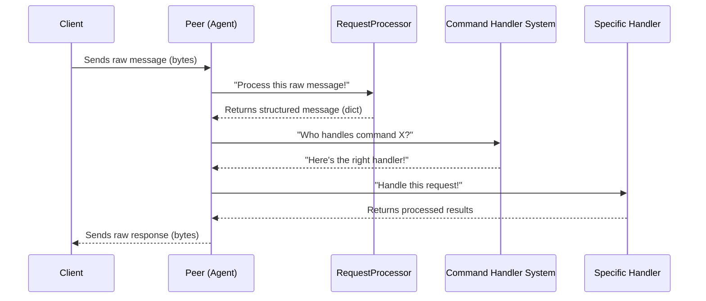

# Chapter 5: Client Connection Handler (Peer)

Welcome back! In [Chapter 1: Application Configuration](01_application_configuration_.html), we set up our application to read its instructions. In [Chapter 2: Communication Protocol](02_communication_protocol_.html), we learned the "language" our server and clients speak. Then, in [Chapter 3: Pear Detection Model (PearDetector)](03_pear_detection_model__peardetector__.html), we introduced our AI "expert" for detecting pears. Most recently, in [Chapter 4: Command Handler System](04_command_handler_system__.html), we explored how our server wisely dispatches different client requests to the right specialist.

Now, imagine our server is running, ready to serve many clients. What happens when a new client connects? And what if several clients connect at the same time, each wanting different things? How does our server manage each conversation without mixing them up?

## The Problem: Giving Each Client Personal Attention

Think of our server as a busy reception desk in a large company. Many visitors (clients) arrive, each with their own requests (commands). If one receptionist tried to handle every visitor from start to finish, it would quickly become overwhelmed. A visitor might ask a question, and before the receptionist can answer, another visitor interrupts with a new question. This would lead to chaos and unhappy visitors!

In the world of computers, if our server tried to handle all clients with a single piece of code, it would face similar problems:
*   **Mixing messages:** Parts of one client's message might get mixed with another's.
*   **Blocking:** If one client sends a very large request that takes a long time to process, all other clients would have to wait, making the server seem slow or unresponsive.
*   **Complexity:** Keeping track of who requested what, and sending the right response back to the right client, would be incredibly difficult.

We need a way for our server to give each client its *own, dedicated attention*, from the moment they connect until they disconnect, without interfering with other clients.

## The Solution: The Client Connection Handler (Peer)

This is where the **Client Connection Handler**, or simply **Peer**, comes in! For every new client that successfully connects to our **LinuxIT-TCP-IP** server, a special, dedicated `Peer` object is created. Think of a `Peer` as a personal "agent" or "concierge" assigned by the receptionist to each visitor.

This personal `Peer` agent is responsible for:
*   **Listening:** It listens only to *its* assigned client's requests.
*   **Understanding:** It takes its client's raw messages and translates them into something the server can understand (as we saw in [Chapter 2: Communication Protocol](02_communication_protocol_.html)).
*   **Dispatching:** It knows *who* in the company (which "handler" from the [Command Handler System](04_command_handler_system__.html)) should deal with its client's specific request.
*   **Responding:** It takes the results from the internal experts and sends a proper, formatted response back *only* to its client.
*   **Independence:** Each `Peer` operates independently. If one client's request takes a long time, it doesn't slow down the `Peer`s handling other clients.

This ensures that each client's session is handled completely on its own, providing a smooth and reliable experience for everyone.

## How Our App Uses the Peer

When a client connects to our server, the server (which we'll explore in [Chapter 6: TCP Server](06_tcp_server_.html)) performs an important first step: it creates a new `Peer` object for that connection.

Here's how a `Peer` comes to life and starts doing its job:

```python
# app.py (simplified - showing where Peer is created)
import asyncio
# ... other imports
from src.server.peer import Peer
from src.model.pear_detector import PearDetector
# from src.server.tcp_server import TCPServer # Full server will do this

async def handle_new_client_connection(reader, writer, server_config, detector):
    # This function is called every time a NEW client connects!
    # A dedicated Peer agent is created for THIS client.
    peer_agent = Peer(reader, writer, server_config, detector)

    # Tell the Peer agent to start managing this connection
    await peer_agent.handle_connection()

    # The Peer agent will handle everything until the client disconnects!
```

In this example, `Peer(...)` creates a new instance of our `Peer` class. It's given special tools: `reader` and `writer` (for talking to the client), `server_config` (for settings like buffer size), and `detector` (our AI expert, the `PearDetector`).

Once created, `await peer_agent.handle_connection()` tells this specific `Peer` agent to start its job: listening, processing, dispatching, and responding to *its* client.

## Under the Hood: The Peer Agent's Daily Routine

Let's look closely at how a `Peer` agent does its job for a single client connection.

### The Peer's Workflow



This sequence shows the continuous loop for one client:
1.  **Client sends data:** The `Peer` agent receives raw bytes from its client.
2.  **Process Request:** The `Peer` gives these raw bytes to its internal `RequestProcessor` to decode, convert, and validate them into a clean Python dictionary.
3.  **Get Handler:** The `Peer` then asks the `Command Handler System` (from Chapter 4) to find the right "specialist" (handler) for the specific command the client sent.
4.  **Handle Request:** The `Peer` tells that specialist handler to process the request.
5.  **Send Response:** Once the handler is done, the `Peer` takes the results, formats them into a proper response message (following the [Communication Protocol](02_communication_protocol_.html)), encodes them back into bytes, and sends them *only* to its client.
This loop repeats until the client disconnects.

### Key Code Pieces in `src/server/peer.py`

The `Peer` class is the heart of this chapter.

#### 1. Setting Up the Peer Agent (`__init__`)

When a new `Peer` object is created, it's given all the tools it needs for its job.

```python
# src/server/peer.py (simplified)
import asyncio
import json
import logging
# ... other necessary imports ...
from ..model.pear_detector import PearDetector

class Peer:
    def __init__(
            self,
            reader: asyncio.StreamReader, # For reading client messages
            writer: asyncio.StreamWriter, # For writing client responses
            config: 'ServerConfig',       # Server settings (buffer size, encoding)
            detector: PearDetector        # Our AI expert for pear detection
    ):
        self.reader = reader
        self.writer = writer
        self.config = config
        self.detector = detector
        self.addr = writer.get_extra_info('peername') # Client's address
        self.request_processor = RequestProcessor()   # Its internal "secretary"
        logger.info(f"Initialized Peer for {self.addr}")
```
The `__init__` method sets up the `Peer` with everything it needs: the `reader` and `writer` streams to talk to *this specific client*, the server `config`, a reference to our shared `PearDetector` expert, and an internal `RequestProcessor` to help it understand messages. `self.addr` identifies *which* client this `Peer` is for.

#### 2. The Agent's Main Job Loop (`handle_connection`)

This is the central function where the `Peer` agent performs its responsibilities for its client.

```python
# src/server/peer.py (simplified)
from ..handlers import get_handler # Function to get command specialists
from ..utils.exceptions import ValidationError

class Peer:
    # ... (init method)

    async def handle_connection(self) -> None:
        logger.info(f"New connection from {self.addr}") # Log the start of a new client session
        try:
            while True: # Keep listening until client disconnects
                # 1. Listen for data from THIS client
                data = await self.reader.read(self.config.buffer_size)
                if not data: # Client disconnected
                    break

                try:
                    # 2. Understand and Validate the message
                    request = self.request_processor.process_request(data, self.config.encoding)
                    logger.info(f"Received request from {self.addr}: {request}")

                    # 3. Get the Right Expert (Dispatch)
                    handler = get_handler(request['cmd'], self.detector)

                    # 4. Tell the expert to handle the request
                    response = await handler.handle(request)

                    # 5. Send Response back to THIS client
                    await self._send_response(response)

                except ValidationError as e:
                    logger.warning(f"Validation error for {self.addr}: {e}")
                    await self._send_error(str(e), error_code=1) # Send specific error
                except Exception as e:
                    logger.error(f"Error processing request for {self.addr}: {e}")
                    await self._send_error("Internal server error", error_code=3) # Generic error

        except asyncio.CancelledError:
            logger.info(f"Connection cancelled for {self.addr}")
        except Exception as e: # Catch other unexpected errors for this connection
            logger.error(f"Unexpected error for {self.addr}: {e}")
        finally:
            await self._cleanup() # Always clean up when done
```
The `handle_connection` method runs in an infinite loop (`while True`) for as long as the client stays connected. It continuously reads incoming data, processes it, dispatches it to the correct handler using `get_handler` (from [Chapter 4](04_command_handler_system__.html)), waits for the handler's response, and then sends that response back to the client. It also includes error handling to gracefully deal with invalid messages or unexpected issues.

#### 3. The Peer Agent's Internal Secretary (`RequestProcessor`)

The `Peer` uses a helper class, `RequestProcessor`, to make sure all incoming messages from its client are correctly understood and valid according to our [Communication Protocol](02_communication_protocol_.html).

```python
# src/server/peer.py (simplified - RequestProcessor part)
# ... (imports)
from ..utils.parsers import convert_str_to_dict
from ..utils.validators import RequestValidator

class RequestProcessor:
    def __init__(self):
        self.validator = RequestValidator() # Tool to check if messages are valid

    def process_request(self, raw_data: bytes, encoding: str) -> Dict[str, Any]:
        """
        Process and validate raw request data.
        """
        data_str = raw_data.decode(encoding) # Step 1: Turn raw bytes into a readable string
        request = convert_str_to_dict(data_str) # Step 2: Convert string (with hex values) to Python dict
        self.validator.validate_basic_structure(request) # Step 3: Check if it has 'cmd' and 'request_data'
        
        # It also does more detailed validation (e.g., if 'request_data' is correct for the 'cmd')
        # ... (simplified for brevity) ...

        return request
```
The `RequestProcessor` decodes the raw bytes, converts any hexadecimal command codes, and then performs crucial validation checks. If a message isn't properly formatted or contains incorrect data for a command, this "secretary" quickly flags it as an error, preventing bad data from reaching our handlers.

#### 4. Sending Responses and Errors (`_send_response`, `_send_error`)

After processing a request, the `Peer` agent needs to communicate back to its client.

```python
# src/server/peer.py (simplified)
# ... (imports)

class Peer:
    # ... (init and handle_connection methods)

    async def _send_response(self, response: Dict[str, Any]) -> None:
        """Send response to client"""
        try:
            # Convert the Python dictionary response to a JSON string, then to bytes
            encoded_response = json.dumps(response).encode(self.config.encoding)
            
            # Write the bytes to THIS client's connection
            self.writer.write(encoded_response)
            await self.writer.drain() # Make sure all data is sent
            logger.info(f"Sent response to {self.addr}: {response}")
        except Exception as e:
            logger.error(f"Error sending response to {self.addr}: {e}")
            raise

    async def _send_error(self, message: str, error_code: int) -> None:
        """Send error response to client in a standard format"""
        error_response = {
            "cmd": None, # Specific command for errors
            "response_data": [{
                "file_name": None,
                "result": None,
                "error_code": error_code,
                "message": message
            }],
            "request_data": None
        }
        await self._send_response(error_response) # Use the same send function
```
`_send_response` takes the Python dictionary that a handler prepared, turns it into a JSON string, then encodes it into bytes, and finally sends it back using its `writer`. `_send_error` is a special version that formats an error message before sending it. This ensures all communication follows the [Communication Protocol](02_communication_protocol_.html).

#### 5. Cleaning Up (`_cleanup`)

When a client disconnects, the `Peer` agent ensures that the connection resources are properly closed.

```python
# src/server/peer.py (simplified)
# ... (imports)

class Peer:
    # ... (other methods)

    async def _cleanup(self) -> None:
        """Clean up connection"""
        try:
            self.writer.close() # Close the connection writer
            await self.writer.wait_closed() # Wait until it's fully closed
            logger.info(f"Connection closed for {self.addr}")
        except Exception as e:
            logger.error(f"Error during cleanup for {self.addr}: {e}")
```
`_cleanup` ensures that the network connection associated with this `Peer` is properly shut down, releasing resources and preventing "ghost" connections.

## Why the Client Connection Handler (Peer) is Great

Using a `Peer` for each client connection provides significant advantages:

*   **Isolation:** Each client's session is completely separate. One client's slow request or error won't affect others.
*   **Concurrency:** Our server can handle many clients at the same time efficiently, because each `Peer` is essentially running its own independent "conversation."
*   **Modularity:** The logic for handling a single client is encapsulated within the `Peer` class, making the code cleaner and easier to manage.
*   **Reliability:** By dedicating resources and logic to each connection, the overall stability of the server increases.

## Conclusion

In this chapter, we've uncovered the crucial role of the **Client Connection Handler (Peer)** in our **LinuxIT-TCP-IP** project. We learned that a `Peer` acts as a dedicated personal agent for each client, managing their entire interaction from listening to requests, ensuring they're valid, dispatching them to the correct internal specialists, and sending back appropriate responses. This fundamental concept allows our server to provide personalized, robust, and concurrent service to many clients simultaneously.

Now that we understand how individual client connections are managed, how does our application bring everything together to actually start listening for these connections? In the next chapter, we'll explore the **[TCP Server](06_tcp_server_.html)** itself, which is the "reception desk" that welcomes new clients and assigns them their `Peer` agents.
