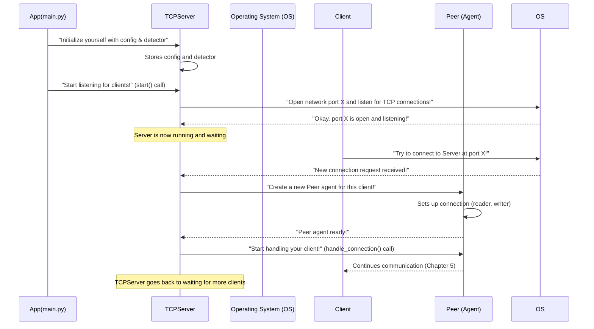

# Chapter 6: TCP Server

Welcome back! In our journey through the **LinuxIT-TCP-IP** project, we've built up many important pieces:
*   In [Chapter 1: Application Configuration](01_application_configuration_.html), we learned how our application loads its setup instructions.
*   In [Chapter 2: Communication Protocol](02_communication_protocol_.html), we defined the "language" our server and clients speak.
*   In [Chapter 3: Pear Detection Model (PearDetector)](03_pear_detection_model__peardetector__.html), we introduced our smart "AI expert" for detecting pears.
*   In [Chapter 4: Command Handler System](04_command_handler_system__.html), we saw how our server dispatches different client requests to the right "specialist."
*   And most recently, in [Chapter 5: Client Connection Handler (Peer)](05_client_connection_handler__peer__.html), we discovered how a dedicated "Peer" agent is assigned to each client to manage their personal conversation.

Now, let's zoom out a bit. All these amazing parts (the `PearDetector` expert, the `Command Handler System` dispatchers, and the `Peer` agents) are ready and waiting. But how does our application *start*? How does it open its "doors" to the network and actually *begin* listening for clients to connect in the first place?

## The Problem: The Grand Opening of Our Service

Imagine our **LinuxIT-TCP-IP** application as a brand new, highly efficient office building filled with all the specialized departments (handlers) and personal concierges (Peers) ready to serve visitors.

The problem is: **how do visitors (clients) know the building is open for business?** And how do they get inside? Someone needs to be at the main entrance, ready to:
1.  Announce: "We are open at this address and door number!"
2.  Welcome: Greet new visitors as they arrive.
3.  Direct: Assign each new visitor to a personal concierge (a `Peer` agent) so they can be helped individually.

Without this central "main entrance" or "reception desk," our fancy internal systems would have no way to receive clients or interact with the outside world.

## The Solution: The TCP Server

This is where the **TCP Server** comes in! The `TCPServer` is the main entry point for our entire application. Think of it as the **central reception desk** of our smart office building.

Here's what the `TCPServer` does:
*   **Listens for Connections:** It constantly "listens" on a specific "host" address (like a street address) and "port" number (like a specific suite number in the building) for new clients trying to connect. These settings come from our [Application Configuration](01_application_configuration_.html).
*   **Welcomes New Clients:** When a new client "knocks" (attempts to connect), the `TCPServer` acknowledges them.
*   **Assigns a Personal Agent (Peer):** For *every single* new client connection, the `TCPServer` immediately assigns a dedicated [Client Connection Handler (Peer)](05_client_connection_handler__peer__.html) agent. This ensures each client gets individual attention without interrupting others.
*   **Manages Overall Capacity:** It keeps track of how many clients can be simultaneously connected, preventing the "building" from getting overcrowded.

The `TCPServer` is the foundation that allows our `LinuxIT-TCP-IP` application to be accessible over the network and interact with multiple clients concurrently.

## How Our App Uses the TCP Server

Let's see how our `app.py` (the main starting point of our application) uses the `TCPServer` to open its doors and begin listening.

Recall from [Chapter 1: Application Configuration](01_application_configuration_.html), our `main` function first loads the application settings:

```python
# app.py (simplified)
import asyncio
import logging
from src.utils.config import ConfigLoader
from src.server.tcp_server import TCPServer # Our TCP Server!
from src.model.pear_detector import PearDetector

async def main():
    try:
        # 1. Load configuration (from Chapter 1)
        config = ConfigLoader.load('config/server_config.yaml')

        # 2. Initialize our AI expert (PearDetector from Chapter 3)
        detector = PearDetector(config.model)
        detector.load_model(config.model.model_path)

        # 3. Initialize and start the TCP Server (Our main reception desk!)
        # We give it server settings and our AI expert
        server = TCPServer(config.server, detector)
        await server.start() # Tell the server to open its doors and start listening!

    except Exception as e:
        logging.error(f"Application error: {e}")
        raise

if __name__ == '__main__':
    # This is what runs when you start the app
    asyncio.run(main())
```

In this code:
*   `server = TCPServer(config.server, detector)`: We create an instance of our `TCPServer`. We give it the `server` specific settings (host, port, max connections) loaded from `server_config.yaml` and a reference to our `detector` (the `PearDetector` from [Chapter 3](03_pear_detection_model__peardetector__.html)) because the `Peer` agents will need access to it later.
*   `await server.start()`: This is the crucial line! It tells the `TCPServer` to begin its job: setting up the network listener and waiting for incoming client connections. Once this line runs, our application is "live" on the network.

## Under the Hood: The Server's Daily Operations

Let's peek behind the curtain to understand the steps the `TCPServer` takes to get up and running, and how it handles new client arrivals.

### The Server's Workflow



### Key Code Pieces in `src/server/tcp_server.py`

The `TCPServer` class defines our central reception desk.

#### 1. Server Settings (`ServerConfig`)

First, let's look at the specific settings the `TCPServer` needs. These are loaded from our `server_config.yaml` file (as seen in [Chapter 1: Application Configuration](01_application_configuration_.html)).

```python
# src/server/tcp_server.py (simplified)
from dataclasses import dataclass

@dataclass
class ServerConfig:
    host: str # The network address to listen on (e.g., "0.0.0.0" means all available addresses)
    port: int # The port number to listen on (e.g., 9090)
    max_connections: int # Maximum number of clients waiting to connect
    buffer_size: int # How much data to read at once
    encoding: str = 'utf-8' # How to understand text data
```
This `ServerConfig` dataclass acts as a neat container for all the network-related settings required by our `TCPServer`.

#### 2. The `TCPServer` Class Setup (`__init__`)

When we create a `TCPServer` object in `app.py`, its `__init__` method sets things up.

```python
# src/server/tcp_server.py (simplified)
import asyncio
import logging
from typing import Optional
from .peer import Peer
from .connection_manager import ConnectionManager
from ..model.pear_detector import PearDetector

logger = logging.getLogger(__name__)

class TCPServer:
    def __init__(self, config: ServerConfig, detector: PearDetector):
        self.config = config # Store the server settings
        self.detector = detector # Store our AI expert (PearDetector)
        self.connection_manager = ConnectionManager() # A helper to keep track of active Peers
        self._server: Optional[asyncio.Server] = None # Placeholder for the actual network server
```
The `__init__` method simply stores the configuration and our `PearDetector`. It also initializes a `ConnectionManager`, which is a small helper that helps the `TCPServer` keep a list of all currently active [Client Connection Handler (Peer)](05_client_connection_handler__peer__.html) agents.

#### 3. Opening the Doors: The `start()` Method

This is the most important method of the `TCPServer`. It tells the computer's operating system to start listening for incoming connections.

```python
# src/server/tcp_server.py (simplified)

class TCPServer:
    # ... (init method)

    async def start(self) -> None:
        try:
            # This line tells Python's asyncio to start a TCP server.
            # It gives it:
            # 1. _handle_client: The function that runs whenever a NEW client connects!
            # 2. host: The address to listen on (e.g., "0.0.0.0")
            # 3. port: The specific door number (e.g., 9090)
            # 4. backlog: Max number of clients waiting in line (from max_connections config)
            self._server = await asyncio.start_server(
                self._handle_client,
                self.config.host,
                self.config.port,
                backlog=self.config.max_connections
            )

            addr = self._server.sockets[0].getsockname()
            logger.info(f'Server running on {addr}') # Confirms server is listening

            # This keeps the server running forever until stopped
            async with self._server:
                await self._server.serve_forever()

        except Exception as e:
            logger.error(f"Server error: {e}")
            raise # Something went wrong starting the server!
```
*   `asyncio.start_server(...)`: This is the core magic! It's an instruction to the `asyncio` library (which handles asynchronous tasks in Python) to set up a network server.
    *   `_handle_client`: This is a very special function. It's like telling the OS: "Whenever a new client connects, call this `_handle_client` function, and I'll take it from there!"
    *   `self.config.host`, `self.config.port`, `self.config.max_connections`: These are the settings loaded from our configuration file.
*   `await self._server.serve_forever()`: Once the server is started, this line keeps it running indefinitely, constantly listening for new connections.

#### 4. Handling a New Client: The `_handle_client()` Method

This function is automatically called by `asyncio` *every single time* a new client successfully connects to our server. This is where the `TCPServer` assigns a personal `Peer` agent.

```python
# src/server/tcp_server.py (simplified)

class TCPServer:
    # ... (init and start methods)

    async def _handle_client(self, reader: asyncio.StreamReader, writer: asyncio.StreamWriter):
        # A. Create a NEW Peer agent for THIS client connection
        # 'reader' and 'writer' are unique tools for this specific client's conversation
        peer = Peer(reader, writer, self.config, self.detector)

        # B. Add this Peer to our list of active connections
        self.connection_manager.add_peer(peer)

        try:
            # C. Tell the new Peer agent to start its job
            # (As explained in Chapter 5, this Peer will handle all communication
            # for this client until they disconnect)
            await peer.handle_connection()

        finally:
            # D. When the client disconnects or an error occurs, clean up
            self.connection_manager.remove_peer(peer) # Remove from active list
            writer.close() # Close the network connection writer
            await writer.wait_closed() # Make sure it's fully closed
```
This `_handle_client` method is very concise but performs crucial steps:
*   `peer = Peer(reader, writer, self.config, self.detector)`: This is where a brand new `Peer` object is created. It's given the `reader` and `writer` objects, which are special communication channels unique to *this specific client connection*. It also gets the `server_config` and our `detector` (AI expert).
*   `self.connection_manager.add_peer(peer)`: The newly created `Peer` agent is added to the `ConnectionManager`'s list, so the server knows it's actively managing this connection.
*   `await peer.handle_connection()`: This tells the newly assigned `Peer` agent to start doing its job, which involves listening to the client, processing requests, and sending responses (as we covered in [Chapter 5](05_client_connection_handler__peer__.html)).
*   `finally`: This block ensures that even if something goes wrong, the `Peer` is removed from the `ConnectionManager`, and the network connection (`writer`) is properly closed.

## Why the TCP Server is So Important

The `TCPServer` is fundamental to our application because it provides:

*   **The Entry Point:** It's the "front door" for all external communication, allowing clients to find and connect to our service.
*   **Concurrency:** By immediately handing off each new connection to a dedicated `Peer` agent, the `TCPServer` allows our application to handle many clients simultaneously without one client's activity blocking another.
*   **Resource Management:** It uses configuration settings to manage how many clients can connect and ensures proper network resources are allocated and released.
*   **Orchestration:** It acts as the orchestrator, setting the stage for `Peer` agents to perform their work.

## Conclusion

In this chapter, we've brought everything together by exploring the **TCP Server**, the central reception desk of our **LinuxIT-TCP-IP** application. We learned how it opens its doors on the network (using host and port from [Application Configuration](01_application_configuration_.html)), constantly listens for incoming clients, and, most importantly, assigns a dedicated [Client Connection Handler (Peer)](05_client_connection_handler__peer__.html) to each new connection. This ensures our application can handle multiple clients concurrently, providing a robust and responsive service!

With the `TCPServer` in place, our application is fully equipped to interact with the world, detect pears, and manage commands.

