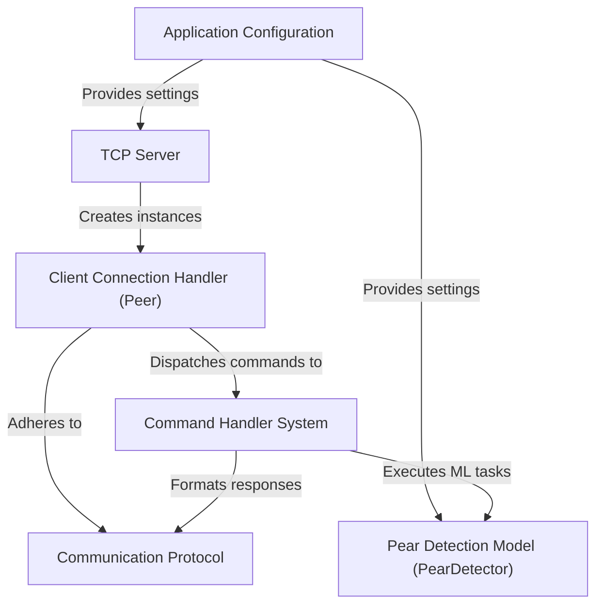

# Tutorial: LinuxIT-TCP-IP

This project is a **TCP server** designed to *listen for incoming connections* from clients. Its primary function is to **process commands** received over the network, with a core focus on *detecting normal and defected pears* using an integrated **AI model**. The system also allows clients to *manage the AI model* itself and *configure image processing directories*.

## Visual Overview

## Chapters

1. [Application Configuration
](01_application_configuration_.html)
2. [Communication Protocol
](02_communication_protocol_.html)
3. [Pear Detection Model (PearDetector)
](03_pear_detection_model__peardetector__.html)
4. [Command Handler System
](04_command_handler_system_.html)
5. [Client Connection Handler (Peer)
](05_client_connection_handler__peer__.html)
6. [TCP Server
](06_tcp_server_.html)
