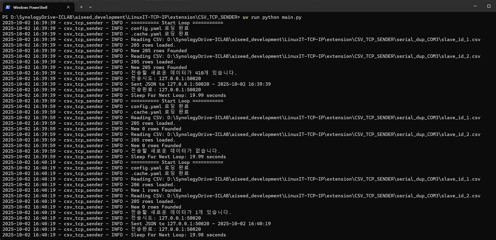
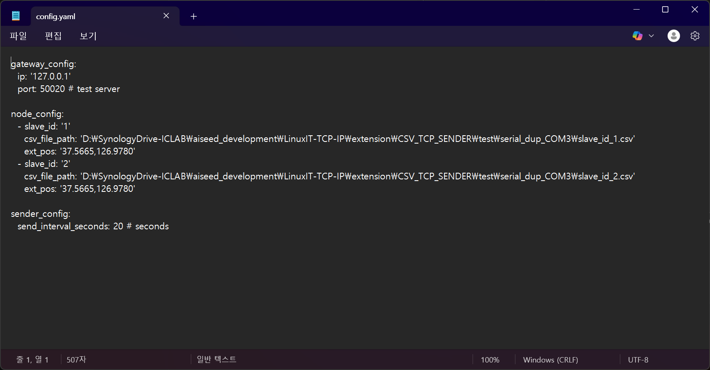

# CSV_TCP_SENDER
* Author : Heonzoo
* version : Python 3.10.18

## Introduction
Linux_IT will develop gateway for sending environmental data to goverment server. So we are trying to send data from our sensor node to gateway.

## Example Run



## Features
* Read AgroTrack Csv data file and convert to json format
* Send json foramt by TCP/IP 
* Loop every time interval
* Store the latest data sent time (cache) and prevent duplicated sending
* Support multi slave csv files
* All log is saved with text file.

## Dependencies
* uv - [get-started](https://docs.astral.sh/uv/getting-started/installation/)


## How to Run
1. Open `config.yaml` and Edit IP and Port for gateway.
1. Also, in `config.yaml` edit `csv file path` which created by  AgroTrack
1. (Optional) change `send_interval_seconds: 20 # seconds` to 600 seconds


1. run `uv run python main.py`

## Test Code
In `test` folder, there are test codes. You can test with following command
```bash
uv run pytest -v
```
